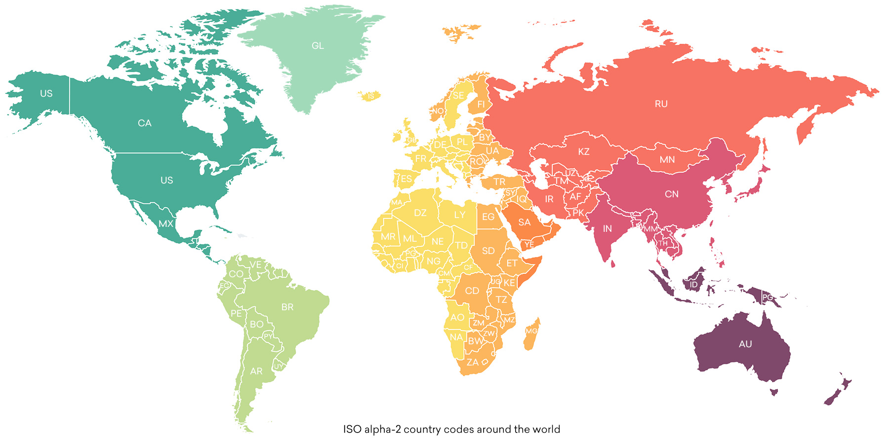

Furthermore, it might be useful to know what data is stored in those both files, so let's display them in the terminal. 

# TXT File Data

To get an idea how the content of the text file looks like, it can be helpful to print out the very first line by executing this:

`spark_txt.first()`{{execute}}

You can see the output in the terminal on the right side. The shown value is basically the content of the first line of that file.

Furthermore, since it is a dataframe which holds a collection of rows, one can print out the total number of rows that the text file has. That can be done by the `count()` function.

`spark_txt.count()`{{execute}}

Now let's print out the first row by using python. Since the data is stored in a list, one only needs to print out the first element from that list:

`python_txt[0]`{{execute}}

The output is shown in the terminal on the right side. Unlike in PySpark, you can see that the text was printed out which is actually a string instead of a Row object.

Furthermore, to get the total amount of lines, one can simply use `len()` to print out the list size:

`len(python_txt)`{{execute}}

The text file contains a famous poem from Johann Wolfgang von Goethe called "Erlking".

# CSV File Data

In the next section, you will see how the data from the csv file can be displayed. In contrast to the txt file data, this data is structured in rows and columns. That is why we need to use other approaches to view the data. First of all, since the data is stored as a schema in pyspark, we can call `printSchema()`:

`spark_csv.printSchema()`{{execute}}

As seen in the terminal, the function prints out all column names and their dedicated data type. To see the actual data that is stored in the dataframe, one can also execute this:

`spark_csv.show()`{{execute}}

That function, on the other hand, prints out the first 20 rows of the dataframe with all columns.

`python_csv.info()`{{execute}}

...

`python_csv.head(20)`{{execute}}

...

The csv file contains data about country codes and regions.

